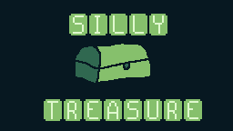

# SillyTresure
## A simple game under 5minutes created by team kings for TWT Timathon



# Created with Pygame

# How to Run
######  After downloading the git hub repo start by installing the modules ```Which are metioned in requirements.txt``` Using pip command ```pip install -r requirements.txt```. Then run main.py using command ```python main.py```

##Controls
###### Use arrows to move, E to collect, B to map1, N to map2, M to open map3. Stand over the board sign so u see some text.

## Created by
##### Coding - M.Tula345
##### Game design - L.Gnani345

# Hope u like
# Thank you 
